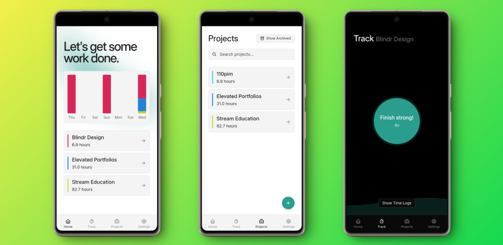

# Heliodex

A cross-platform time tracking application built with Tauri, SvelteKit, and TypeScript that helps you monitor time spent on different projects.



## Features

- **Project-based Time Tracking**: Create and manage multiple projects, each with its own time logs
- **Real-time Tracking**: Start and stop time tracking with a single click
- **Visual Analytics**: View your time data through interactive bar charts showing daily activity
- **Project Management**:
  - Create, rename, and delete projects
  - Archive inactive projects
  - Search and filter projects
- **Detailed Time Logs**: Review and manage detailed time entries for each project
- **Offline-first**: Local SQLite database for reliable data storage
- **Modern UI**: Clean, responsive interface with smooth animations and haptic feedback

## Development

1. Install dependencies:

```bash
bun install
```

2. Run development server:

```bash
bun run tauri dev
```

3. Build for production:

```bash
bun run tauri build
```
